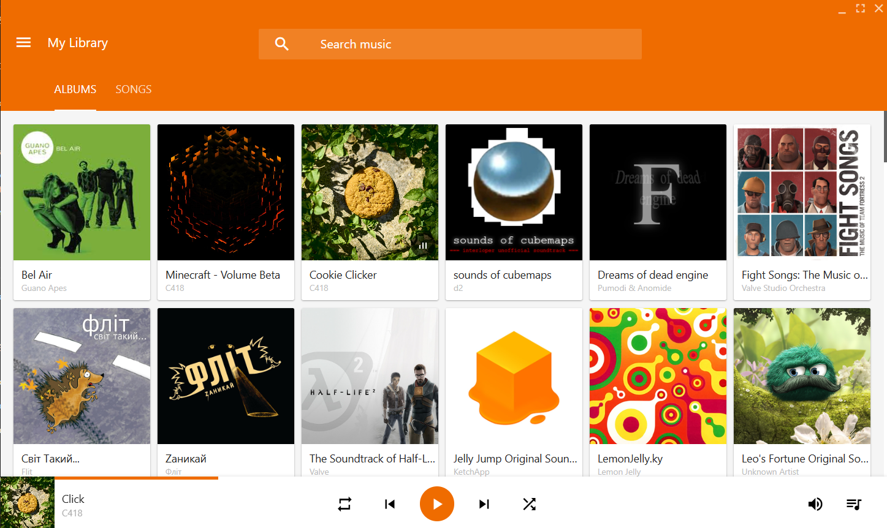
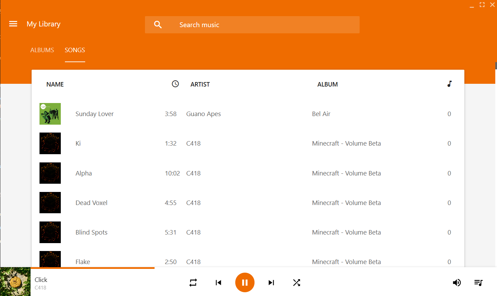
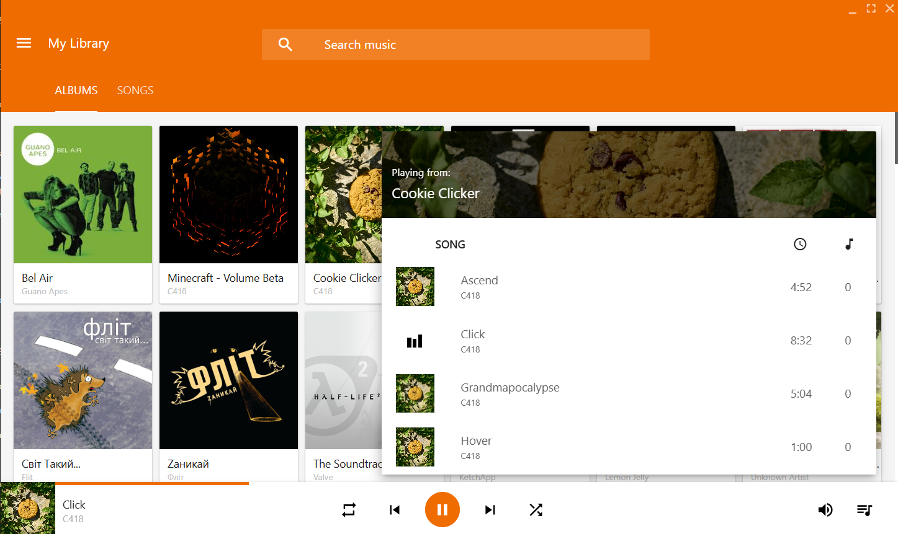
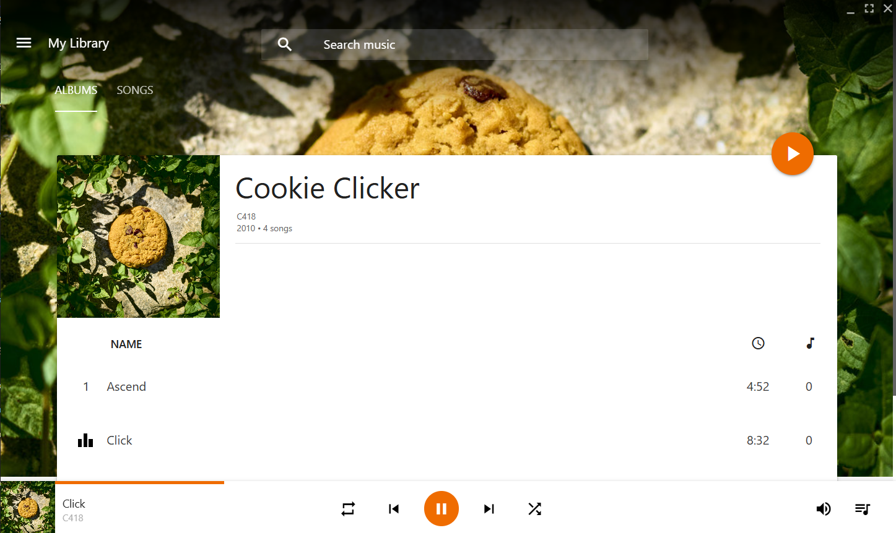
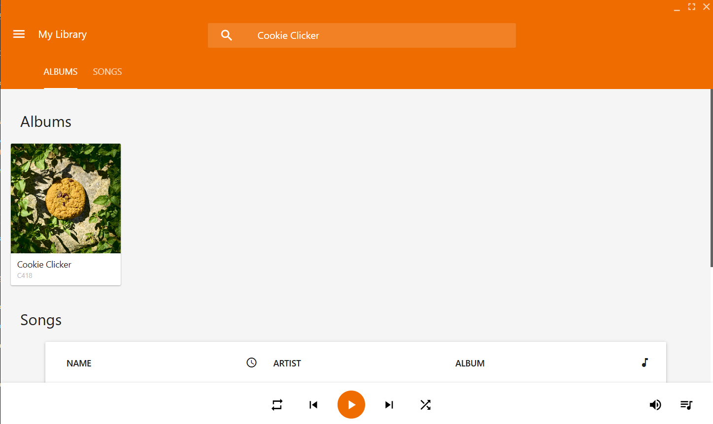
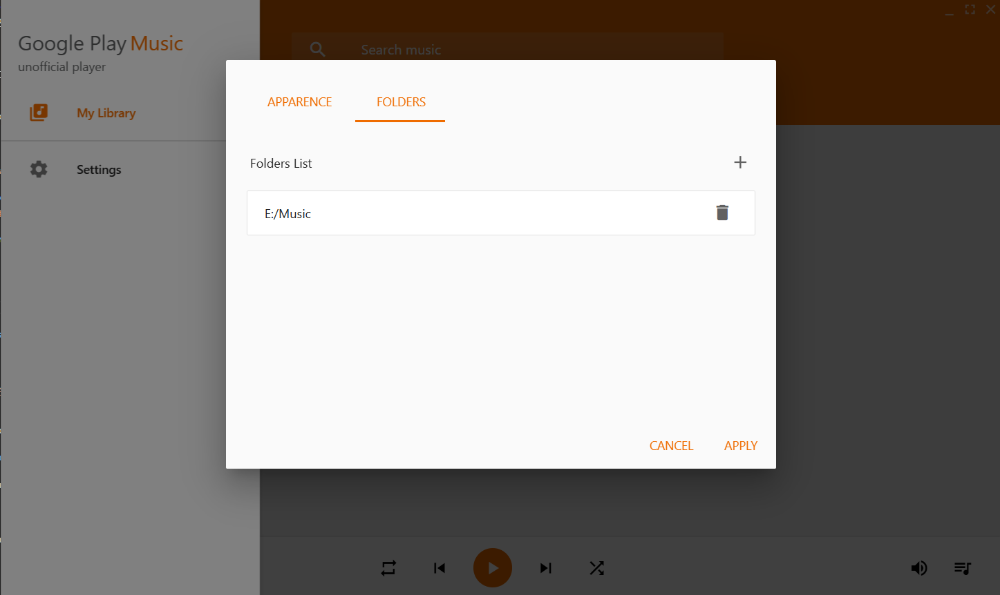
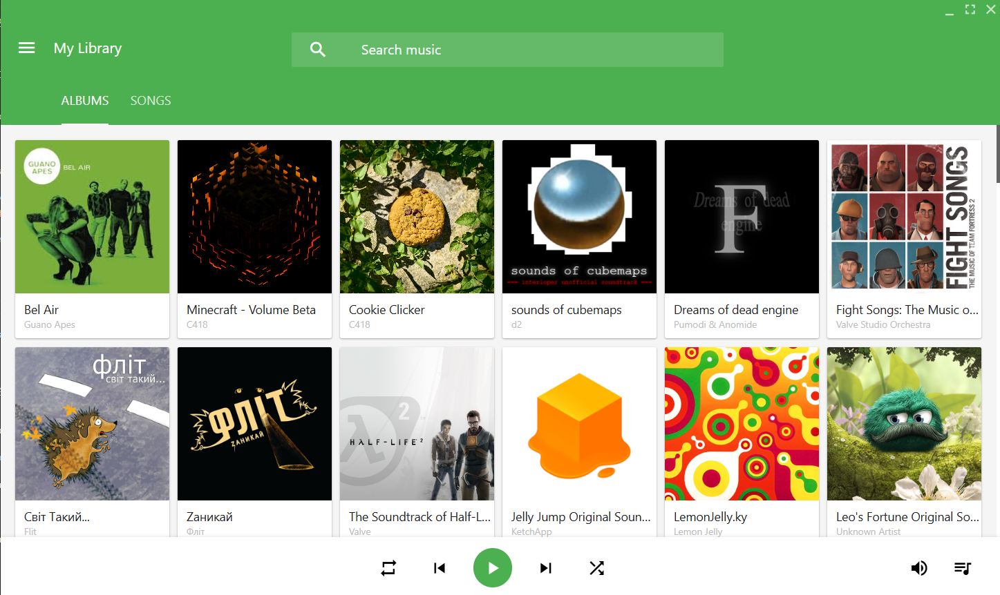
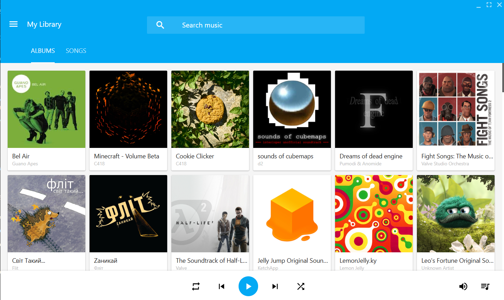

#

GPMUP - its a local music player with GPM Functional and design

> [!WARNING]
> No affiliation with Google. Google Play is a trademark of Google Inc. 

# Modules

- [Music Metadata](https://www.npmjs.com/package/music-metadata)
- [Materialize CSS](https://materializecss.com/)
- [ElectronJS](https://github.com/electron/electron)
- [ElectronForge](https://github.com/electron/forge)

# Links and Communities

- [Google Play Music on Reddit](https://www.reddit.com/r/googleplaymusic/s/t23ruriLJW)
- [Google Play Music on Wiki](https://wikipedia.org/wiki/Google_Play_Music)

# Gallery

| Albums List | Songs List|
|:-----------------:|:-----------:|
|  |  |

| Playlist Card | Opened Album |
|:-----------------:|:-----------:|
|  |  |

| Search Page | Settings |
|:-----------------:|:-----------:|
|  |  |

| Custom accent colors | Custom accent colors |
|:-----------------:|:-----------:|
|  |  |

# Project preparation

Copy that repo using
``` Bash
git clone https://github.com/DanilVusenko86/Google-Play-Music-Unofficial-Player.git
```

Then install modules using *npm*

# Debugging and Testing

For Debugging use
``` Bash
npm start
```
For packaging use
``` Bash
npm run make
```